# Git + Gitea — A Practical Guide

A hands-on reference for developers who want to start using Git with a self-hosted Gitea server. Written for beginners to intermediate users — short on theory, long on the commands and clicks you'll actually use day-to-day.

---

## Table of Contents

1. [Introduction](#1-introduction)
2. [Git Basics](#2-git-basics)
   - 2.1 [What is Git?](#21-what-is-git)
   - 2.2 [Installing Git](#22-installing-git)
   - 2.3 [First-Time Configuration](#23-first-time-configuration)
   - 2.4 [Core Concepts](#24-core-concepts)
3. [Gitea Setup and Access](#3-gitea-setup-and-access)
   - 3.1 [What is Gitea?](#31-what-is-gitea)
   - 3.2 [Creating an Account](#32-creating-an-account)
   - 3.3 [Setting Up SSH Keys](#33-setting-up-ssh-keys)
   - 3.4 [Personal Access Tokens (HTTPS)](#34-personal-access-tokens-https)
   - 3.5 [Creating Your First Repository](#35-creating-your-first-repository)
4. [Core Workflows](#4-core-workflows)
   - 4.1 [Cloning a Repository](#41-cloning-a-repository)
   - 4.2 [Branching](#42-branching)
   - 4.3 [Staging and Committing](#43-staging-and-committing)
   - 4.4 [Pushing Changes](#44-pushing-changes)
   - 4.5 [Pulling and Fetching](#45-pulling-and-fetching)
   - 4.6 [Pull Requests and Merging](#46-pull-requests-and-merging)
   - 4.7 [Resolving Merge Conflicts](#47-resolving-merge-conflicts)
5. [Repository Management in Gitea](#5-repository-management-in-gitea)
   - 5.1 [Repository Settings](#51-repository-settings)
   - 5.2 [Collaborators and Teams](#52-collaborators-and-teams)
   - 5.3 [Branch Protection](#53-branch-protection)
   - 5.4 [Issues and Labels](#54-issues-and-labels)
   - 5.5 [Releases and Tags](#55-releases-and-tags)
   - 5.6 [Webhooks](#56-webhooks)
6. [Common Mistakes and How to Avoid Them](#6-common-mistakes-and-how-to-avoid-them)
7. [Best Practices](#7-best-practices)
8. [Quick Reference Cheat Sheet](#8-quick-reference-cheat-sheet)

---

## 1. Introduction

Git is the version-control system that tracks every change to your code. Gitea is a lightweight, self-hosted platform — similar to GitHub or GitLab — that gives your team a place to host repositories, review pull requests, and manage issues without depending on a third-party service.

This guide walks you through everything you need to ship your first change through Gitea: installing Git, connecting to the Gitea server, cloning a repository, making a change, opening a pull request, and getting it merged.

> **Who this is for:** Developers, QA engineers, and technical writers who are new to Git or new to Gitea specifically. No prior experience with command-line tools is assumed.

---

## 2. Git Basics

### 2.1 What is Git?

Git is a **distributed version control system**. Every developer has a complete copy of the project history on their machine. That means you can work offline, experiment freely on branches, and never lose work as long as you commit.

Three ideas to keep in mind:

- **Snapshot, not diff** — every commit records the state of your project at that point in time.
- **Local first** — most operations (commit, branch, log, diff) happen on your machine. You only talk to the server when you `push` or `pull`.
- **Branches are cheap** — creating a branch is essentially free. Use them liberally.

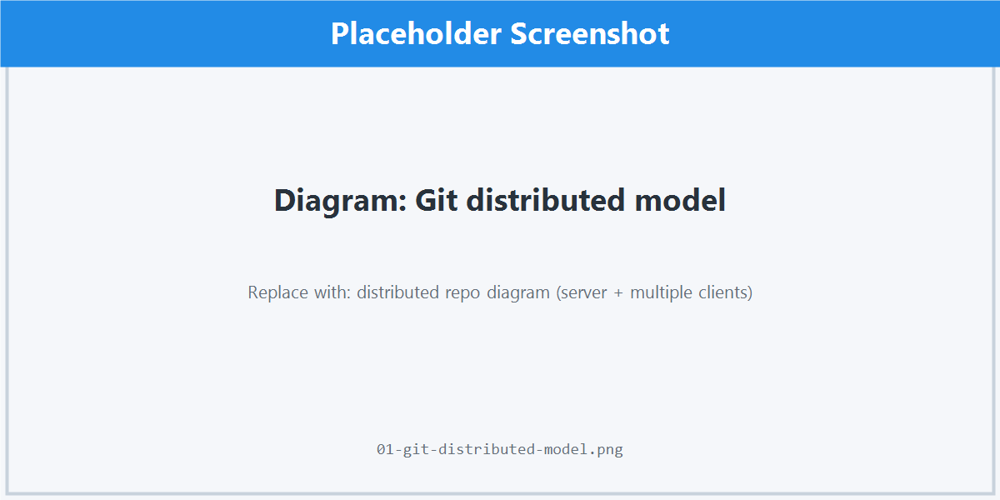

### 2.2 Installing Git

| Platform | Command / Steps |
| --- | --- |
| **Windows** | Download from [git-scm.com/download/win](https://git-scm.com/download/win) and run the installer. Accept defaults unless you have a reason to change them. |
| **macOS** | `brew install git` (Homebrew) or download from [git-scm.com](https://git-scm.com). |
| **Ubuntu / Debian** | `sudo apt update && sudo apt install git` |
| **Fedora / RHEL** | `sudo dnf install git` |

Verify the install:

```bash
git --version
# git version 2.43.0 (or newer)
```

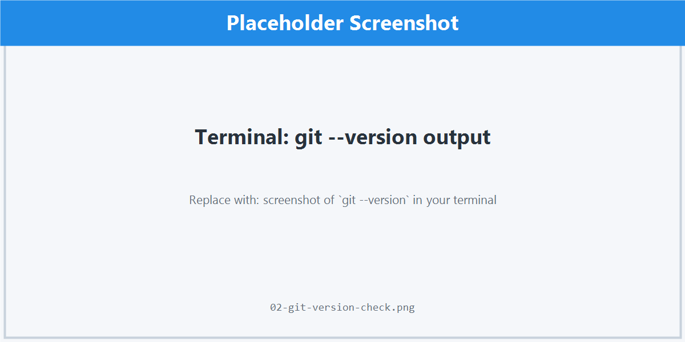

### 2.3 First-Time Configuration

Tell Git who you are. These values appear in every commit you make.

```bash
git config --global user.name "Your Name"
git config --global user.email "you@example.com"
```

Recommended quality-of-life settings:

```bash
# Use 'main' as the default branch name for new repos
git config --global init.defaultBranch main

# Make line endings behave (Windows)
git config --global core.autocrlf true

# Make line endings behave (macOS / Linux)
git config --global core.autocrlf input

# Use VS Code as your default editor (optional)
git config --global core.editor "code --wait"

# Show colors in terminal output
git config --global color.ui auto
```

Check your config any time:

```bash
git config --list
```

### 2.4 Core Concepts

| Term | What it means |
| --- | --- |
| **Repository (repo)** | A folder tracked by Git. Contains all project files plus a hidden `.git` directory with history. |
| **Working directory** | The files you see and edit on disk. |
| **Staging area (index)** | A holding area for changes you've selected to include in the next commit. |
| **Commit** | A saved snapshot with a message, author, and timestamp. Identified by a SHA hash. |
| **Branch** | A movable pointer to a commit. Lets you work on features in isolation. |
| **HEAD** | A pointer to the branch (or commit) you currently have checked out. |
| **Remote** | A version of your repo hosted elsewhere (in our case, on Gitea). Usually called `origin`. |
| **Merge** | Combining changes from one branch into another. |

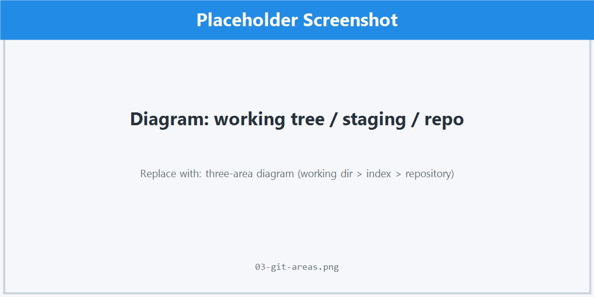

---

## 3. Gitea Setup and Access

### 3.1 What is Gitea?

Gitea is an open-source Git hosting platform. It runs anywhere — a laptop, a VPS, a corporate server — and gives you a web UI for repositories, pull requests, issues, wikis, and CI integrations.

Typical Gitea URLs look like:

```
https://gitea.your-company.com
https://git.example.org
```

> Your team will give you the URL. Replace `gitea.example.com` throughout this guide with your actual server.

### 3.2 Creating an Account

1. Open your Gitea server URL in a browser.
2. Click **Register** in the top-right corner. If registration is disabled, ask your admin to create an account for you.
3. Fill in username, email, and password. Use the same email you configured in `git config --global user.email`.
4. Confirm your email if the server requires it.
5. Sign in.

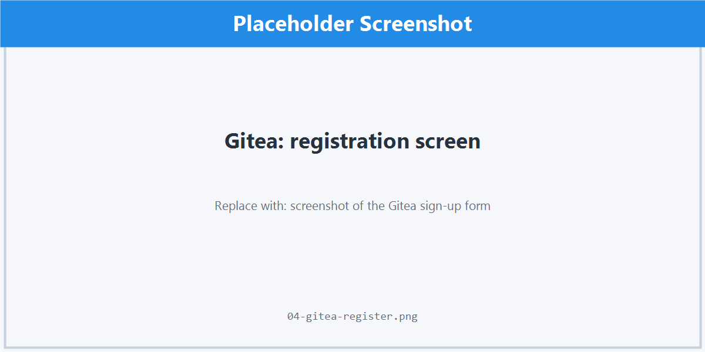

### 3.3 Setting Up SSH Keys

SSH is the most convenient way to authenticate. Once set up, you'll never type a password.

**Step 1 — Generate a key (only if you don't already have one):**

```bash
ssh-keygen -t ed25519 -C "you@example.com"
```

Press Enter to accept the default location (`~/.ssh/id_ed25519`). Optionally set a passphrase.

**Step 2 — Copy the public key to your clipboard:**

```bash
# macOS
pbcopy < ~/.ssh/id_ed25519.pub

# Linux
xclip -sel clip < ~/.ssh/id_ed25519.pub

# Windows (PowerShell)
Get-Content $env:USERPROFILE\.ssh\id_ed25519.pub | Set-Clipboard
```

**Step 3 — Add the key to Gitea:**

1. Click your avatar (top-right) → **Settings**.
2. Open the **SSH / GPG Keys** tab.
3. Click **Add Key**.
4. Paste the public key into the **Content** field, give it a name like `Laptop — 2026`, and save.

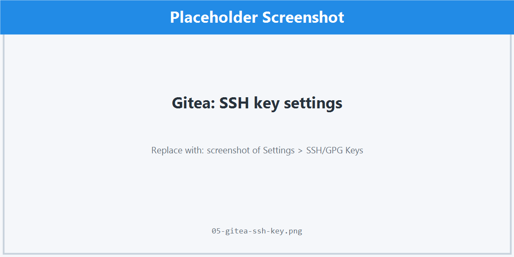

**Step 4 — Verify the connection:**

```bash
ssh -T git@gitea.example.com
# Hi <username>! You've successfully authenticated...
```

### 3.4 Personal Access Tokens (HTTPS)

If your network blocks SSH, use HTTPS with a personal access token (PAT) instead of your password.

1. **Settings → Applications → Generate New Token.**
2. Give it a name and select the scopes you need (typically `repo`).
3. Copy the token immediately — Gitea only shows it once.
4. When Git prompts for a password during `clone` or `push`, paste the token instead.

To avoid typing it every time, enable the credential helper:

```bash
# macOS
git config --global credential.helper osxkeychain

# Windows (already enabled by Git for Windows)
git config --global credential.helper manager

# Linux
git config --global credential.helper "cache --timeout=86400"
```

### 3.5 Creating Your First Repository

1. Click the **+** in the top-right corner → **New Repository**.
2. Fill in:
   - **Owner** — your username or an organization.
   - **Repository Name** — short, lowercase, hyphenated (`payments-api`, not `Payments API`).
   - **Description** — one line; future-you will thank you.
   - **Visibility** — Public or Private.
   - **Initialize Repository** — tick this to add a README, `.gitignore`, and license. Recommended for new projects.
3. Click **Create Repository**.

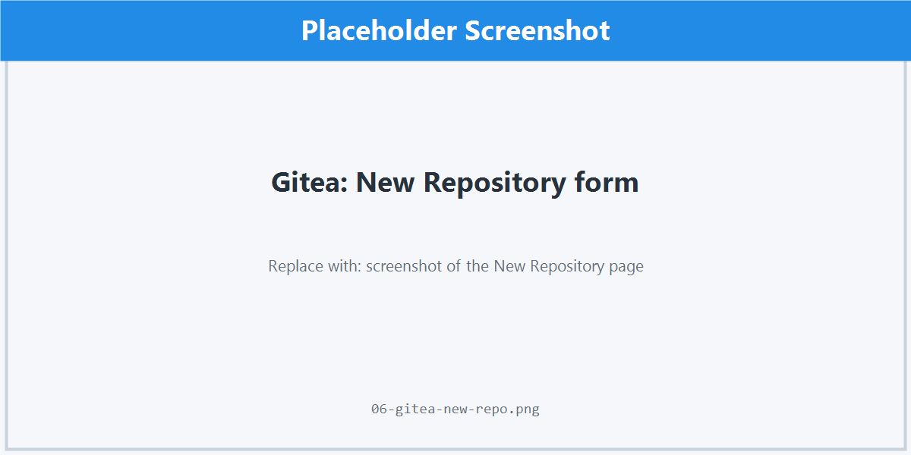

You'll land on the repo page with HTTPS and SSH clone URLs ready to copy.

---

## 4. Core Workflows

This section is the heart of the guide. The flow you'll use 95% of the time is:

```
clone → branch → edit → stage → commit → push → pull request → merge
```

### 4.1 Cloning a Repository

Copy the SSH or HTTPS URL from the repo's main page.

```bash
# SSH (recommended)
git clone git@gitea.example.com:your-org/payments-api.git

# HTTPS
git clone https://gitea.example.com/your-org/payments-api.git
```

```bash
cd payments-api
git status
# On branch main
# nothing to commit, working tree clean
```

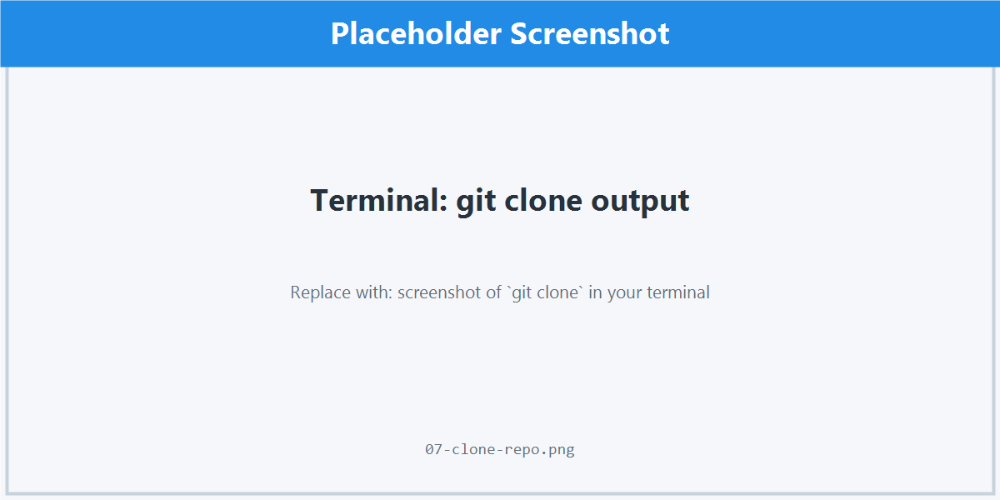

### 4.2 Branching

Never commit directly to `main`. Always work on a feature branch.

**Create and switch to a new branch:**

```bash
git switch -c feat/add-login-page
# (older syntax: git checkout -b feat/add-login-page)
```

**List branches:**

```bash
git branch         # local
git branch -r      # remote
git branch -a      # all
```

**Switch between branches:**

```bash
git switch main
git switch feat/add-login-page
```

**Delete a branch you're done with:**

```bash
git branch -d feat/add-login-page          # safe — only if merged
git branch -D feat/add-login-page          # force, even if unmerged
git push origin --delete feat/add-login-page  # delete on Gitea too
```

**Branch naming conventions** (pick one and stick with it):

| Prefix | When to use |
| --- | --- |
| `feat/` | New feature |
| `fix/` | Bug fix |
| `chore/` | Tooling, dependencies, refactors with no behavior change |
| `docs/` | Documentation only |
| `hotfix/` | Urgent production fix |

### 4.3 Staging and Committing

Git separates "what's changed" (the working tree) from "what's about to be committed" (the staging area). This lets you craft tidy, focused commits.

**See what changed:**

```bash
git status              # short summary
git diff                # unstaged changes
git diff --staged       # what will be committed
```

**Stage changes:**

```bash
git add path/to/file.py        # specific file
git add src/                   # whole directory
git add -p                     # interactive — pick hunks
git add .                      # everything in current directory
```

**Commit:**

```bash
git commit -m "Add login page with email/password form"
```

For longer messages, omit `-m` to open your editor:

```bash
git commit
```

A good commit message:

```
Add login page with email/password form

- Adds <LoginForm /> component with client-side validation
- Wires submit handler to /api/auth/login
- Adds loading + error states

Closes #142
```

**Amend the last commit** (only before pushing):

```bash
git commit --amend                  # change message or add staged files
git commit --amend --no-edit        # add files without changing message
```

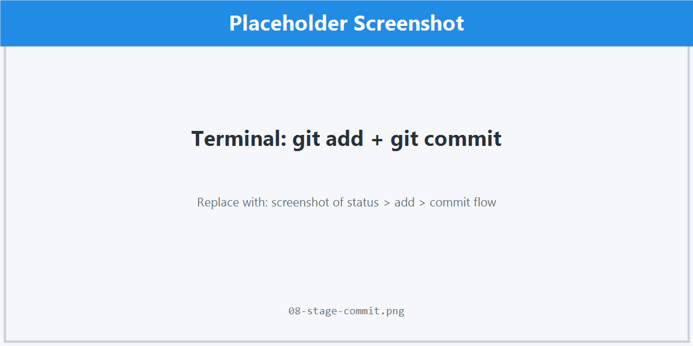

### 4.4 Pushing Changes

Push your local branch to Gitea:

```bash
# First push — sets the upstream
git push -u origin feat/add-login-page

# Subsequent pushes
git push
```

After pushing, refresh the repo page in Gitea. You'll see a banner offering to open a pull request from your branch.

### 4.5 Pulling and Fetching

Other people's commits land on the server. To bring them down:

```bash
git fetch                # download changes, don't merge yet
git pull                 # fetch + merge into current branch
git pull --rebase        # fetch + rebase (linear history, recommended)
```

Set rebase as the default for `pull`:

```bash
git config --global pull.rebase true
```

> **Rule of thumb:** Pull from `main` regularly while working on a feature branch to avoid painful merges later.

```bash
git switch main
git pull
git switch feat/add-login-page
git rebase main          # bring your branch up to date
```

### 4.6 Pull Requests and Merging

A pull request (PR) is a proposal: "please merge these commits from my branch into yours." Gitea uses PRs as the place for code review and discussion.

**Opening a PR:**

1. Push your branch.
2. On the repo page, click **Pull Requests → New Pull Request**.
3. Choose the **base** branch (usually `main`) and the **compare** branch (your feature branch).
4. Write a clear title and description:
   - **What** changed
   - **Why** it changed
   - **How** to test it
   - Link related issues with `#123`
5. Add reviewers, labels, and milestones if you use them.
6. Click **Create Pull Request**.

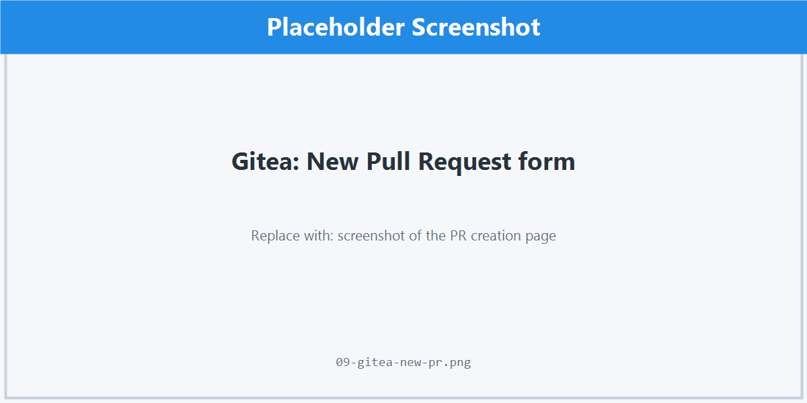

**During review:**

- Respond to comments with code changes (push to the same branch — the PR updates automatically) or with replies.
- Use **Resolve conversation** to mark threads as done.

**Merging:**

Gitea supports several merge strategies:

| Strategy | What it does | When to use |
| --- | --- | --- |
| **Create merge commit** | Adds a merge commit preserving full branch history | Default; keeps audit trail |
| **Rebase** | Replays your commits on top of base; no merge commit | Clean linear history, requires discipline |
| **Rebase + merge commit** | Rebase then add a merge commit | Hybrid — linear plus clear "merged here" marker |
| **Squash** | Combines all your commits into one | Feature branches with many WIP commits |

After merging, delete the source branch (Gitea offers a button) and pull `main` locally:

```bash
git switch main
git pull
git branch -d feat/add-login-page
```

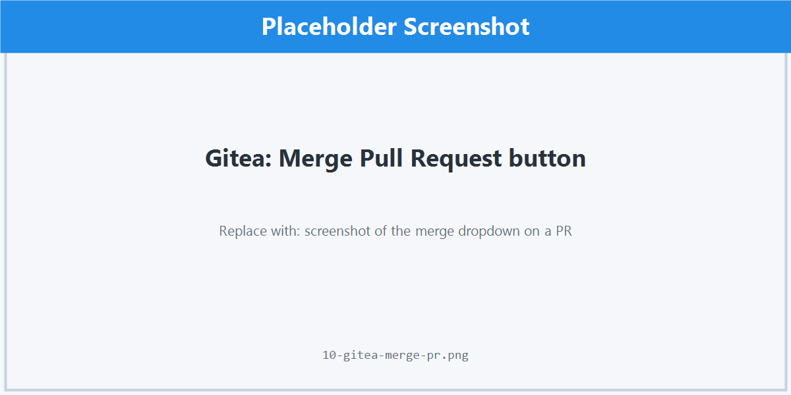

### 4.7 Resolving Merge Conflicts

Conflicts happen when two branches change the same lines. Git pauses and asks you to choose.

```bash
git pull --rebase
# CONFLICT (content): Merge conflict in src/auth.js
```

Open the file. You'll see markers:

```
<<<<<<< HEAD
const TIMEOUT = 5000;
=======
const TIMEOUT = 10000;
>>>>>>> feat/add-login-page
```

Edit the file to the version you want, remove all the markers, then:

```bash
git add src/auth.js
git rebase --continue        # if you were rebasing
# or
git commit                   # if you were merging
```

To abort and start over:

```bash
git rebase --abort
git merge --abort
```

> **Tip:** Use a merge tool. `git mergetool` works with VS Code, Beyond Compare, KDiff3, and most IDEs.

---

## 5. Repository Management in Gitea

### 5.1 Repository Settings

Click **Settings** on the repo page (only owners and admins see it). Useful tabs:

- **General** — rename, change description/visibility, archive.
- **Collaborators** — see [5.2](#52-collaborators-and-teams).
- **Branches** — set the default branch and branch protection.
- **Webhooks** — see [5.6](#56-webhooks).
- **Deploy Keys** — read/write SSH keys scoped to one repo (for CI servers).
- **Danger Zone** — transfer, archive, or delete the repo.

### 5.2 Collaborators and Teams

**Individual collaborators:**

1. **Settings → Collaborators.**
2. Type the username and pick a permission: **Read**, **Write**, or **Admin**.
3. Click **Add Collaborator**.

**Teams (for organization repos):**

Organizations let you group users into teams (e.g., `backend`, `frontend`, `qa`) and grant permissions at the team level. This scales better than adding collaborators one at a time.

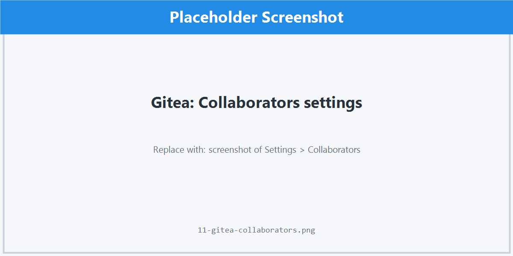

### 5.3 Branch Protection

Stop accidental pushes to `main`.

1. **Settings → Branches → Protected Branches.**
2. Select `main` (or your default branch) and click **Edit**.
3. Enable:
   - **Disable Push** for everyone except admins
   - **Require Pull Request Reviews** with at least 1 approver
   - **Require Status Checks** if you have CI
   - **Require Signed Commits** if your team uses GPG signing
4. Save.

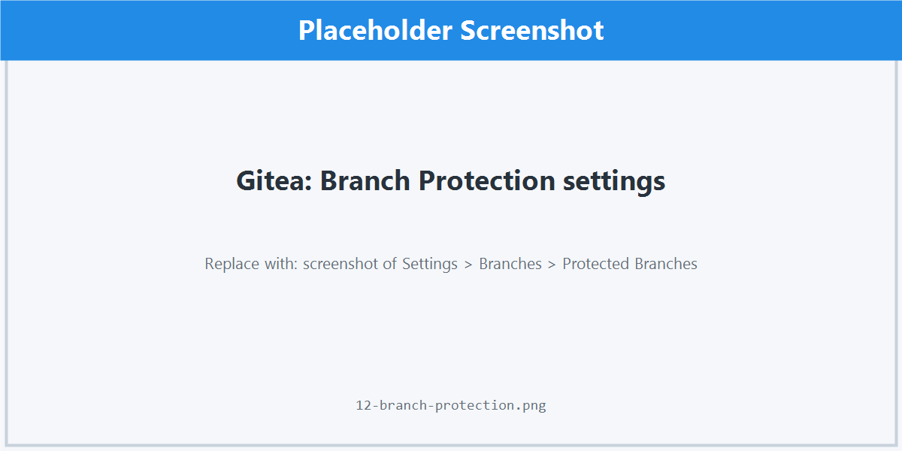

### 5.4 Issues and Labels

**Opening an issue:** Issues tab → **New Issue.** Use the description to explain the problem, expected behavior, and steps to reproduce.

**Linking commits to issues:** Mention `#123` in a commit message or PR description to link them. Use closing keywords to auto-close when the PR merges:

- `Closes #123`
- `Fixes #123`
- `Resolves #123`

**Labels:** Settings → Labels. Create a small set with consistent colors (`bug`, `enhancement`, `documentation`, `good first issue`, `needs triage`). Avoid label sprawl.

### 5.5 Releases and Tags

Tags mark important points in history (usually releases).

```bash
git tag -a v1.2.0 -m "Release 1.2.0"
git push origin v1.2.0
```

In Gitea, **Releases → New Release** lets you attach release notes, binaries, and changelogs to a tag.

### 5.6 Webhooks

Webhooks let Gitea notify external services on events (push, PR opened, issue closed).

1. **Settings → Webhooks → Add Webhook.**
2. Pick the type (Gitea, Slack, Discord, custom).
3. Enter the target URL.
4. Choose which events trigger it.
5. Save and test with the **Test Delivery** button.

Common uses: triggering CI runs, posting to chat, syncing to issue trackers.

---

## 6. Common Mistakes and How to Avoid Them

| Mistake | What goes wrong | How to avoid it |
| --- | --- | --- |
| **Committing directly to `main`** | History gets messy; no review; risky on shared branches. | Always create a feature branch. Enable branch protection. |
| **Committing secrets** | API keys, `.env` files, or passwords end up in history forever. | Add them to `.gitignore` before the first commit. Use a secret scanner. If leaked, rotate the secret immediately — removing the commit isn't enough. |
| **Force-pushing shared branches** | Overwrites teammates' commits. | Never `git push --force` to shared branches. Use `--force-with-lease` if you must, and only on your own feature branch. |
| **Huge "fix everything" commits** | Impossible to review or revert. | Make small, focused commits. Use `git add -p` to split changes. |
| **Vague commit messages** (`fix`, `update`, `wip`) | Git log becomes useless. | Write what the commit does and why. Imperative mood: "Add", "Fix", "Refactor". |
| **Pulling without checking branch** | Pulls main into your feature branch by accident. | Run `git status` first. Set `git config --global pull.rebase true`. |
| **Ignoring `.gitignore` until later** | Build artifacts, IDE configs, and `node_modules/` pollute history. | Start from a template: [github.com/github/gitignore](https://github.com/github/gitignore). |
| **Working on stale branches** | Painful merge conflicts. | Pull `main` daily. Rebase your branch on `main` before opening a PR. |
| **Stashing and forgetting** | `git stash` piles up; you lose track of what's where. | Prefer WIP commits on a branch. If you stash, name it: `git stash push -m "wip login form"`. |
| **Deleting files without `git rm`** | Deletes leave the working tree dirty in a confusing way. | Use `git rm path/to/file` so the deletion is staged. |
| **Mixing rebase and merge in the same branch** | Confusing history with duplicate commits. | Decide on one strategy per branch and stick with it. |
| **Bypassing PRs because "it's a small change"** | Audit trail breaks; small changes still break things. | Every change goes through a PR, even one-line typo fixes. |

---

## 7. Best Practices

### Commit hygiene

- **One logical change per commit.** If you can't describe it in one sentence, split it.
- **Imperative mood:** "Add validation" not "Added validation".
- **Subject ≤ 72 chars**, blank line, then a body explaining *why* (not *what* — the diff shows *what*).

### Branch hygiene

- **Short-lived branches.** Aim for less than a week. Long branches drift.
- **Rebase before merging** to keep history readable (if your team agrees).
- **Delete merged branches.** They clutter the branch list.

### Pull request hygiene

- **Keep PRs small** — under ~400 lines of diff if possible. Reviewers do better work on smaller chunks.
- **Self-review first.** Read your own diff in Gitea before requesting review.
- **Fill in the description.** What, why, how to test. Link the issue.
- **Respond promptly to review comments.** Reviewers are blocked on you.

### Repo hygiene

- **README on day one** — what the project is, how to run it, who owns it.
- **`.gitignore` on day one** — never commit `node_modules/`, `.env`, `*.log`, IDE files.
- **License file** if the repo is public.
- **Use issues and milestones** to track work; don't keep it in chat.

### Security

- **Never commit secrets.** Use environment variables or a secrets manager.
- **Enable 2FA** on your Gitea account.
- **Sign commits with GPG** if your team requires it.
- **Rotate SSH keys** when devices change hands.

---

## 8. Quick Reference Cheat Sheet

### Setup

```bash
git config --global user.name "Your Name"
git config --global user.email "you@example.com"
git config --global init.defaultBranch main
git config --global pull.rebase true
```

### Daily flow

```bash
git clone git@gitea.example.com:org/repo.git
cd repo
git switch -c feat/my-feature

# ...edit files...

git status
git diff
git add .
git commit -m "Add my feature"
git push -u origin feat/my-feature
# Open PR in Gitea
```

### Staying in sync

```bash
git switch main
git pull
git switch feat/my-feature
git rebase main
```

### Inspect

```bash
git log --oneline --graph --decorate --all
git show <commit-sha>
git blame path/to/file
git diff main..feat/my-feature
```

### Undo (safely)

```bash
git restore path/to/file              # discard unstaged changes to a file
git restore --staged path/to/file     # unstage a file
git revert <commit-sha>               # create a new commit that undoes another
git reset --soft HEAD~1               # undo last commit, keep changes staged
git reset --hard HEAD~1               # NUKE the last commit and changes (careful!)
```

### Recover

```bash
git reflog                            # see everything HEAD has pointed to recently
git checkout <sha-from-reflog>        # go back to a "lost" state
git stash list                        # see stashed changes
git stash pop                         # apply and remove the top stash
```

---

## Closing notes

Git rewards small, frequent commits and small, frequent pulls. If you find yourself in a confusing state, run `git status` — it almost always tells you what to do next. When in doubt, `git reflog` will rescue almost any commit you thought you lost.

Welcome aboard. Now go ship something.
